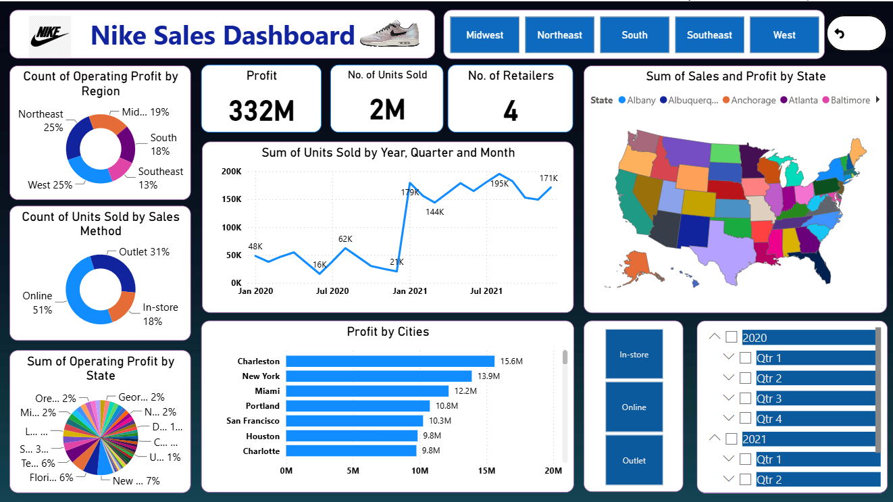

<div align="center">

# 👟 Nike Sales Dashboard

### 📊 Interactive Sales Analytics Dashboard using Power BI

<p>
  
  
  
  
  
</p>


</div>

---

# 📌 Project Overview

The **Nike Sales Dashboard** is an interactive Power BI dashboard that provides valuable insights into Nike's sales performance across different regions, states, cities, retailers, and sales methods.

The dashboard helps businesses monitor KPIs, identify top-performing locations, analyze sales trends, and make informed decisions using interactive visualizations and filters.

---

# 🖥 Dashboard Preview

<p align="center">

</p>

> **Note:** Your screenshot file is currently named **Dashboard.png.png**. You may rename it to **Dashboard.png** for a cleaner repository.

---

# ✨ Dashboard Features

- 📈 Sales Trend Analysis
- 💰 Profit Analysis
- 📦 Units Sold Analysis
- 🏪 Retailer Performance
- 🌎 Region-wise Sales Analysis
- 🗺 State-wise Sales Map
- 🏙 City-wise Profit Analysis
- 🛒 Sales Method Comparison
- 📅 Year & Quarter Filters
- 🎛 Interactive Slicers

---

# 📊 Key Performance Indicators

| KPI | Value |
|------|-------|
| 💰 Total Profit | **332M** |
| 📦 Units Sold | **2M** |
| 🏪 Retailers | **4** |
| 🌎 Regions Covered | **5** |
| 🗺 State Analysis | ✔ |

---

# 📈 Dashboard Visualizations

- 🍩 Donut Charts
- 📈 Line Chart
- 📊 Bar Chart
- 🗺 Filled Map
- 🎯 KPI Cards
- 🎛 Slicers
- 📋 Matrix

---

# 🛠 Technologies Used

| Technology | Purpose |
|------------|----------|
| Power BI | Dashboard Development |
| DAX | Measures & Calculations |
| Excel | Dataset |
| Power Query | Data Cleaning |
| Data Modeling | Relationships |

---

# 📂 Repository Structure

```
Nike-Sales-Dashboard-PowerBI
│
├── Dashboard.png.png
├── Nike Sales DashBoard1.pbix
├── Nike Sales Datasets (1).xlsx
└── README.md
```

---

# 💡 Business Insights

- 📍 West and Northeast regions contribute significantly to overall profit.
- 📦 Online sales account for the highest share of units sold.
- 🏙 Charleston, New York, and Miami are among the top-performing cities.
- 📊 Interactive filters allow users to explore data by region, year, quarter, and sales method.

---

# 🎯 Skills Demonstrated

- Business Intelligence
- Data Visualization
- Dashboard Design
- Power BI
- DAX
- Data Modeling
- Power Query
- KPI Reporting
- Business Analytics

---

# 🚀 Getting Started

### Clone this Repository

```bash
git clone https://github.com/rohitmahajan45/Nike-Sales-Dashboard-PowerBI.git
```

Open the `.pbix` file using **Microsoft Power BI Desktop**.

---

# 📥 Project Files

- 📊 Power BI Dashboard (.pbix)
- 📁 Excel Dataset (.xlsx)
- 🖼 Dashboard Screenshot
- 📄 Project Documentation

---

# 🔮 Future Enhancements

- Forecasting using Power BI
- Customer Segmentation
- Drill-through Reports
- Advanced DAX Measures
- Mobile Responsive Dashboard

---

# 👨‍💻 Author

## Rohit Mahajan

**Aspiring Data Analyst | Power BI | SQL | Excel | Data Visualization**

---

## 🌐 Connect with Me

<p align="left">

<a href="https://github.com/rohitmahajan45">

</a>

<a href="https://www.linkedin.com/in/rohitmahajan45">

</a>

</p>

---

<div align="center">

### ⭐ If you found this project useful, please consider giving it a Star!

Made with ❤️ using Microsoft Power BI

</div>
