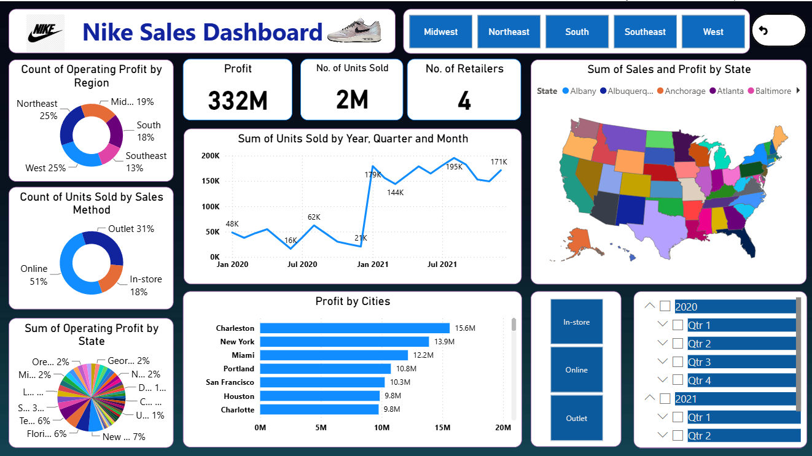

# 👟 Nike Sales Analytics Dashboard

### **Interactive Business Intelligence Dashboard built with Power BI**

  
  
  
  

  
  

**📊 Sales Analysis • 💰 Profit Tracking • 🏪 Retailer Performance • 🌎 Regional Insights**

---

## 📌 About The Project

The **Nike Sales Analytics Dashboard** is an interactive Power BI business intelligence project designed to analyze sales and profitability across different **regions, states, cities, retailers, products, and sales methods**.

The dashboard transforms raw Excel data into meaningful business insights through **KPIs, interactive filters, DAX calculations, charts, maps, and data modeling**.

### 🎯 Main Objective

> **Turn raw sales data into actionable insights that help businesses understand performance, identify trends, and support data-driven decisions.**

---

## 🖥️ Dashboard Preview

---

## 📊 Dashboard Highlights

<table>
<tr>
<td width="50%">

### 💰 Performance

* Total Profit Analysis
* Units Sold
* Sales Performance
* Profit Trends
* KPI Monitoring

</td>

<td width="50%">

### 🌎 Geographic Analysis

* Region-wise Performance
* State-wise Sales
* City-wise Profit
* Location Comparison
* Interactive Map

</td>
</tr>

<tr>
<td>

### 🏪 Retail Analysis

* Retailer Performance
* Retailer Comparison
* Top Performing Locations
* Sales Contribution

</td>

<td>

### 🛒 Sales Channels

* Online Sales
* In-store Sales
* Outlet Sales
* Sales Method Comparison

</td>
</tr>
</table>

---

# 📈 Key Metrics

| 💰 Total Profit | 📦 Units Sold | 🏪 Retailers | 🌎 Regions |
| :-------------: | :-----------: | :----------: | :--------: |
|     **332M**    |     **2M**    |     **4**    |    **5**   |

---

# 🔍 Business Questions Answered

This dashboard helps answer questions such as:

* Which region generates the highest profit?
* Which cities are performing the best?
* Which retailers contribute the most sales?
* Which sales method generates the highest volume?
* How does performance change over time?
* Which states contribute most to overall sales?
* What are the major sales and profit trends?

---

# 📊 Visualizations Used

| Visualization | Purpose                      |
| ------------- | ---------------------------- |
| 🎯 KPI Cards  | Track major business metrics |
| 📈 Line Chart | Analyze sales/pr             |
